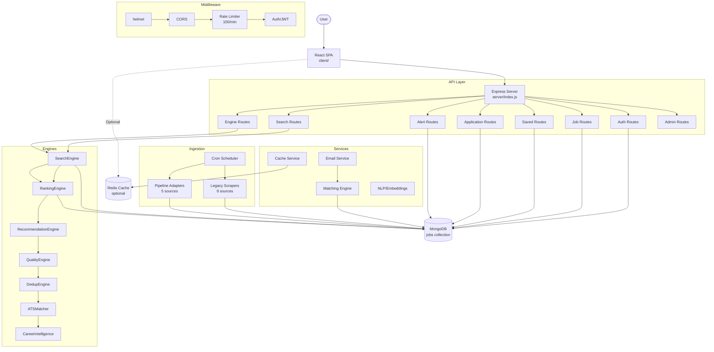

# Architecture

**Last Updated:** July 25, 2026
**Related Docs:** [Backend](./08-Backend.md), [Frontend](./09-Frontend.md), [Scrapers](./12-Scrapers.md)

---

## High-Level System Diagram



## Data Flow

### Request Lifecycle

```
Browser → React → Axios → Express → Middleware → Route → Controller/Engine → MongoDB → Response
```

1. **Browser** sends HTTP request to Express server
2. **Middleware** processes: helmet (security headers) → CORS → Rate limiter → Request logger → Auth (if needed)
3. **Route handler** validates params, delegates to engine or model
4. **Engine** performs business logic (search, rank, recommend, score)
5. **MongoDB** returns data
6. **Response** formatted and returned to frontend

### Job Ingestion Pipeline

```
External Source → Scraper/Adapter → Normalizer → Validator → Deduplicator → Storage → MongoDB
                          │
                          ▼
                    Matching Engine → Email Alerts
```

Two parallel ingestion paths:
- **Legacy Scrapers** (server/scrapers/) — 9 sources, hourly cron
- **Pipeline Adapters** (server/pipeline/) — 5 sources, configurable cron schedules

Both write to the same `jobs` MongoDB collection. Source sets are disjoint (verified safe).

### Authentication Flow

```
Login → POST /api/auth/login → JWT created → Stored in localStorage
                                 │
                                 ▼
Subsequent requests → Bearer token in Authorization header
                         → authMiddleware verifies → req.userId set
                         → adminMiddleware checks ADMIN_USER_ID (optional)
```

Guest mode bypasses auth: `localStorage.setItem('guest', 'true')` — read-only access.

## Folder Responsibilities

| Directory | Purpose |
|-----------|---------|
| `client/src/` | React SPA — pages, components, contexts, hooks |
| `server/routes/` | 15 Express routers — HTTP interface |
| `server/models/` | 12 Mongoose schemas — data models |
| `server/middleware/` | Auth, admin, logger middleware |
| `server/engine/` | 7 stateless engines — core business logic |
| `server/services/` | Cache, email, matching, embeddings |
| `server/scrapers/` | 9 legacy scrapers — job ingestion |
| `server/pipeline/` | Modular pipeline ingestion (5 sources) |
| `server/workers/` | Batch scripts — dedup, quality, recommendations |
| `server/scheduler.js` | Legacy cron scheduler |
| `docs/` | All documentation |

## Security Architecture

| Layer | Measure |
|-------|---------|
| HTTP Headers | Helmet (CSP, X-Frame-Options, X-Content-Type-Options, etc.) |
| Rate Limiting | 100 req/min global, 20 req/min for pipeline API |
| Authentication | JWT with 7-day expiry, Bearer token |
| Authorization | Admin middleware checks ADMIN_USER_ID env var |
| Input Validation | Mongoose schema validation, route-level checks |
| Secrets | .env file, JWT_SECRET validated at startup |

## Error Handling

- **Global error logger** — Captures all unhandled errors to `logs/error.log`
- **Process signals** — SIGINT/SIGTERM: graceful MongoDB disconnect
- **Uncaught exceptions** — Logged, server shuts down gracefully
- **Route errors** — Caught per-route, returned as 500 JSON
- **SMTP failures** — Thrown, caught by matching engine, logged as `failed` in MatchLog
